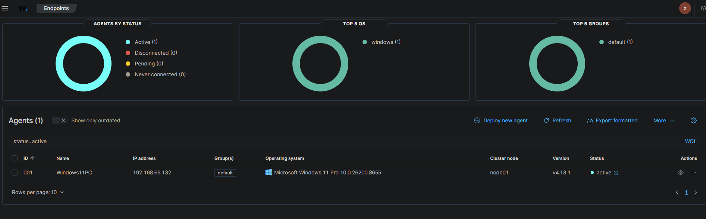
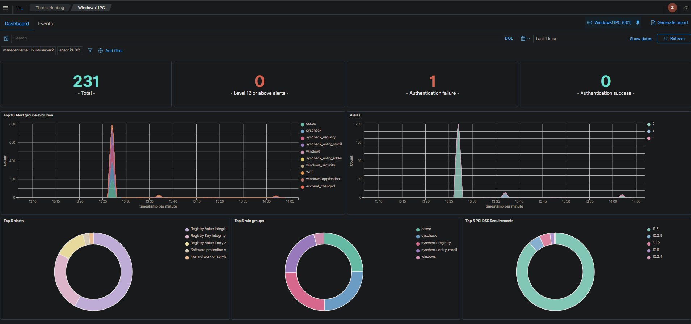
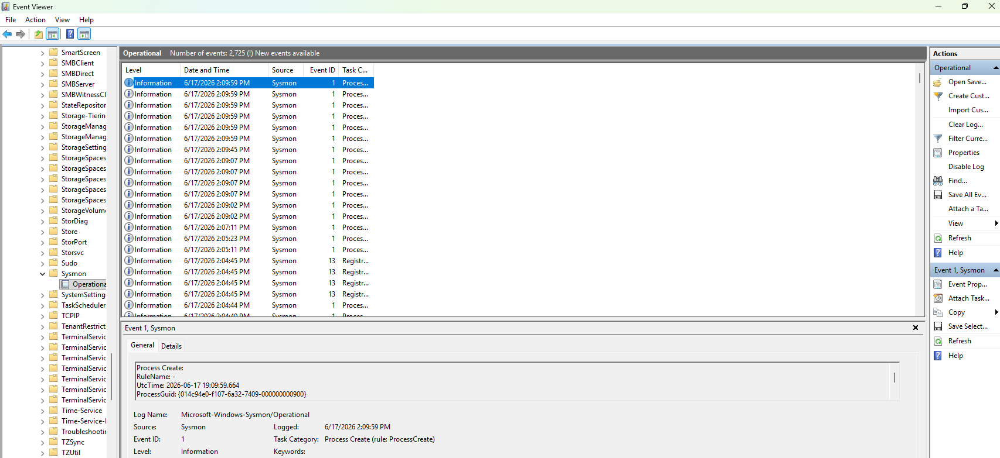

# Baseline Agent Visibility

## Objective

Verify that the Wazuh server is receiving telemetry from monitored endpoints.

## Lab Components

| System | Role |
|---|---|
| Ubuntu Server VM | Wazuh server |
| Windows 11 VM | Monitored endpoint |
| Kali Linux VM | Attack simulation machine |

## Wuzah Dashboard Connected
 
## Windows Endpoint is reporting to Wazuh
 
 ## Sysmon is installed and running on the Windows endpoint
 

## Why This Matters

Before a SOC analyst can investigate alerts, they must confirm that log sources are online, agents are healthy, and telemetry is actually being ingested.
