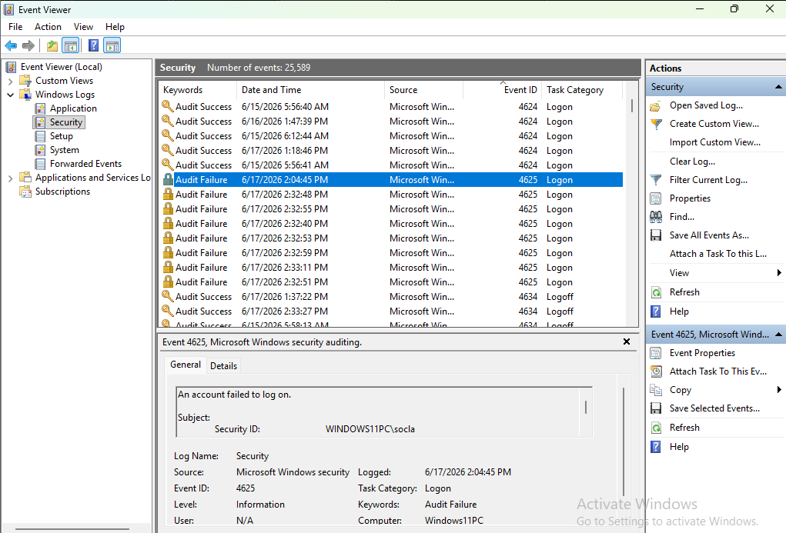
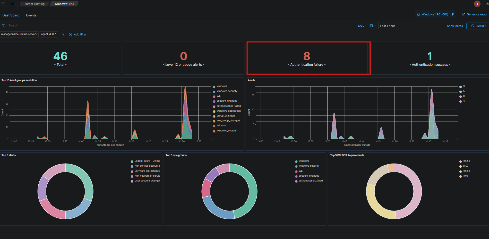
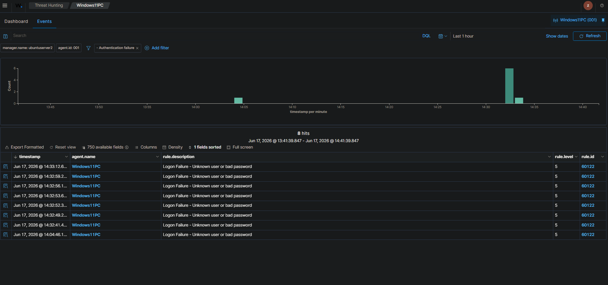
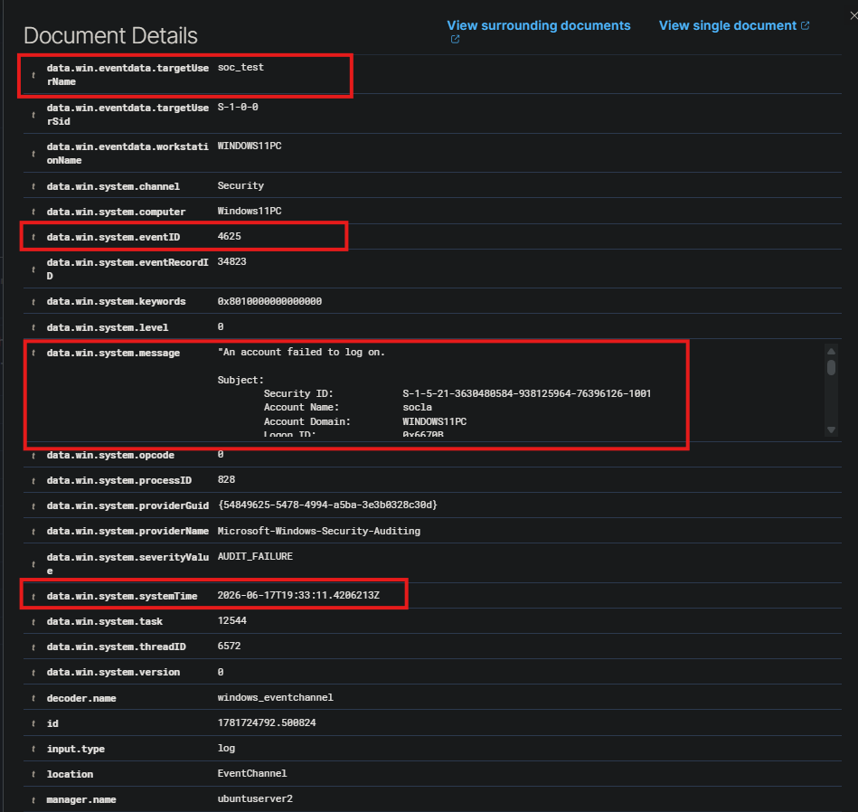

# Failed Windows Login Monitoring

## Objective

Generate failed Windows login attempts on a monitored endpoint and verify that the activity is visible in Wazuh.

## Scenario

A local test account was created on the Windows 11 VM. Multiple failed login attempts were generated to simulate suspicious authentication activity.

## Tools Used

| Tool | Purpose |
|---|---|
| Windows 11 VM | Monitored endpoint |
| Wazuh Agent | Endpoint log forwarding |
| Wazuh Dashboard | SIEM alert/event review |
| Windows Event Viewer | Local log validation |

## Test Account

| Account | Purpose |
|---|---|
| soc_test | Local test account used to generate authentication events |

## Steps Performed

1. Created a local test user named `soc_test`.
2. Attempted to run a command as `soc_test` using incorrect passwords.
3. Verified that Windows generated Event ID 4625 in Event Viewer.
4. Searched Wazuh for the failed login activity.
5. Reviewed the event details in Wazuh.
6. Documented the endpoint, username, timestamp, and event information.

## Evidence

### Windows Event Viewer - Failed Login Event

This screenshot confirms that the Windows 11 endpoint generated a failed login event locally.

---

### Wazuh Search Results

This screenshot shows the failed login activity appearing in Wazuh Dashboard and Event Page.

---

### Wazuh Event Details

This screenshot shows the detailed event data collected by Wazuh.

## Analysis

The failed login attempts generated Windows Security Event ID 4625. This event indicates that an account failed to authenticate to the system. In a real SOC environment, repeated failed logins could indicate a mistyped password, password guessing, brute-force activity, or unauthorized access attempts.

The event was first validated locally in Windows Event Viewer and then confirmed in Wazuh. This confirms that the Windows endpoint is forwarding authentication-related security logs to the SIEM.

## SOC Analyst Notes

Important fields to review during a failed login investigation include:

| Field | Why It Matters |
|---|---|
| Username | Identifies the account targeted |
| Hostname | Identifies the affected endpoint |
| Timestamp | Helps build the event timeline |
| Logon Type | Shows whether the attempt was local, network, remote, or service-based |
| Failure Reason | Helps determine why authentication failed |
| Source IP/Workstation | Helps identify where the attempt came from, if available |

## Recommended Response

If this activity occurred in a production environment, the next steps would be:

1. Confirm whether the login attempts were expected.
2. Determine whether the account belongs to a real user or service.
3. Check whether a successful login occurred after the failures.
4. Review the source system or IP address.
5. Escalate if the failures are repeated, unusual, or tied to privileged accounts.

## Skills Demonstrated

- Windows Security log analysis
- SIEM event searching
- Authentication monitoring
- Failed login investigation
- Endpoint telemetry validation
- SOC-style documentation
