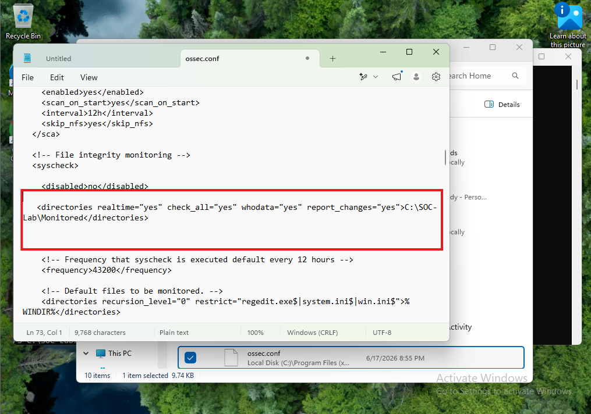
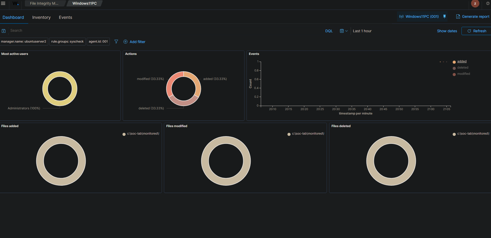
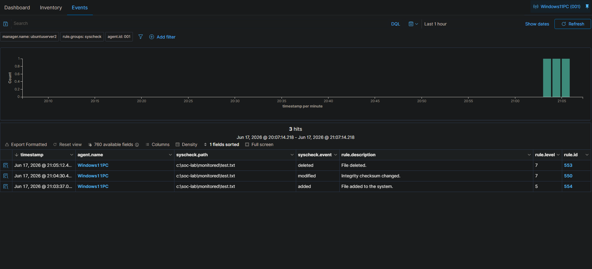
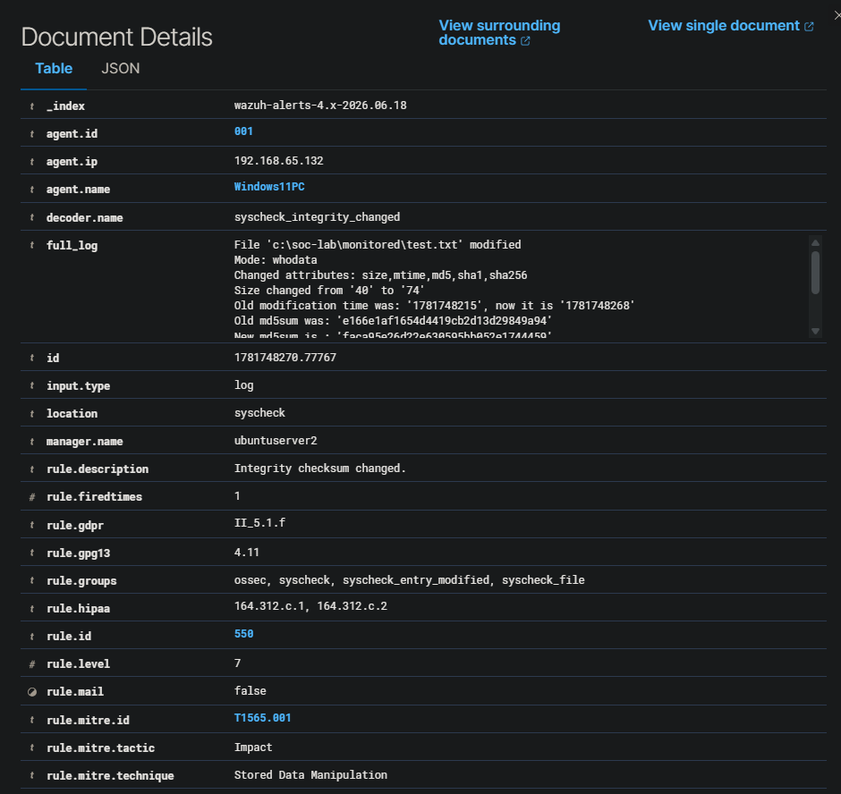

# File Monitoring in Wazuh

## Objective

Configure File Integrity Monitoring in Wazuh to monitor a specific folder on a Windows 11 endpoint and verify that file creation, modification, and deletion events are detected in the Wazuh dashboard.

## Scenario

A test folder was created on the Windows 11 endpoint and added to the local Wazuh agent configuration. After restarting the Wazuh agent, a test file was created, modified, and deleted inside the monitored folder. Wazuh successfully detected all three file activity events.

## Tools Used

| Tool                            | Purpose                                                     |
| ------------------------------- | ----------------------------------------------------------- |
| Wazuh                           | SIEM/XDR platform used for file monitoring and alert review |
| Wazuh Agent                     | Endpoint agent installed on the Windows 11 VM               |
| Windows 11 VM                   | Monitored endpoint                                          |
| PowerShell                      | Used to create, modify, and delete the test file            |
| Wazuh File Integrity Monitoring | Used to detect file changes                                 |

## Monitored Path

The monitored folder used for this lab was:

```text
C:\SOC-Lab\Monitored
```

The test file used for the monitoring activity was:

```text
C:\SOC-Lab\Monitored\test.txt
```

## Configuration

File Integrity Monitoring was configured by editing the local Wazuh agent configuration file on the Windows 11 endpoint:

```text
C:\Program Files (x86)\ossec-agent\ossec.conf
```

The following directory entry was added inside the `<syscheck>` section:

```xml
<directories realtime="yes" check_all="yes" whodata="yes" report_changes="yes">C:\SOC-Lab\Monitored</directories>
```

This configuration tells Wazuh to monitor the selected folder for file changes, including file creation, modification, and deletion.

## Evidence

### Wazuh Agent Configuration

The screenshot below shows the `ossec.conf` file edited on the Windows 11 endpoint. The highlighted line shows the monitored folder path added to the File Integrity Monitoring configuration.



---

### File Integrity Monitoring Dashboard

The Wazuh File Integrity Monitoring dashboard shows activity for the monitored Windows 11 endpoint. The dashboard displays file activity categories, including added, modified, and deleted file events.



---

### File Monitoring Events

The Events tab shows three file integrity events for `test.txt` inside the monitored folder.

| Event         | Rule Description           | Rule ID | Rule Level |
| ------------- | -------------------------- | ------- | ---------- |
| File added    | File added to the system   | 554     | 5          |
| File modified | Integrity checksum changed | 550     | 7          |
| File deleted  | File deleted               | 553     | 7          |



---

### Event Details

The expanded event details show that Wazuh detected a modification to:

```text
c:\soc-lab\monitored\test.txt
```

The event was collected from the Windows 11 endpoint named `Windows11PC` and processed by the Wazuh manager `ubuntuserver2`. The event used the `syscheck_integrity_changed` decoder and generated rule ID `550`, indicating an integrity checksum change.



## Analysis

Wazuh successfully detected file integrity events from the monitored Windows 11 endpoint. The test file generated three separate events: added, modified, and deleted.

The modified file event was especially useful because Wazuh identified that the file size and cryptographic hashes changed. This shows that Wazuh was not only detecting that the file existed, but also tracking changes to file integrity values such as checksums.

In a real SOC environment, this type of monitoring could be used to watch sensitive directories, configuration files, startup folders, scripts, or application folders for unauthorized changes. File integrity events can help analysts identify suspicious activity such as tampering, persistence attempts, unauthorized configuration changes, or modification of critical files.

## SOC Analyst Notes

Important fields reviewed during this investigation included:

| Field        | Why It Matters                                           |
| ------------ | -------------------------------------------------------- |
| Agent Name   | Identifies the endpoint where the file activity occurred |
| File Path    | Shows exactly which file was affected                    |
| Event Type   | Shows whether the file was added, modified, or deleted   |
| Rule ID      | Identifies the Wazuh detection rule that triggered       |
| Rule Level   | Helps estimate alert severity                            |
| Timestamp    | Helps build an event timeline                            |
| Hash Changes | Confirms file content or metadata changed                |

## Alternative Configuration Method

For this lab, File Integrity Monitoring was configured directly on the Windows 11 endpoint by editing the local Wazuh agent configuration file.

This approach works well in a small lab environment because only one endpoint needed to be configured and tested. In a larger environment with multiple endpoints, a better approach would be to use Wazuh centralized agent configuration. Centralized configuration allows monitoring settings to be managed from the Wazuh manager and applied to agent groups instead of manually editing each endpoint.

For example, a Windows endpoint group could be created, and the same File Integrity Monitoring configuration could be pushed to every Windows agent in that group. This would make the configuration easier to manage, reduce manual work, and help keep monitoring settings consistent across multiple systems.

## Recommended Response

If similar file activity occurred in a production environment, a SOC analyst should:

1. Identify the endpoint where the file change occurred.
2. Review the affected file path.
3. Determine whether the change was expected or authorized.
4. Review the user or process associated with the file change if available.
5. Check surrounding activity for related alerts.
6. Escalate if the file change affected a sensitive location or appeared unauthorized.

## Skills Demonstrated

* File Integrity Monitoring configuration
* Wazuh agent configuration
* Windows endpoint monitoring
* SIEM event review
* File creation, modification, and deletion detection
* Rule ID and alert detail analysis
* SOC-style investigation documentation

## Conclusion

This lab confirmed that Wazuh can monitor a selected folder on a Windows endpoint and detect file integrity changes. The Windows 11 endpoint successfully reported file creation, modification, and deletion events to the Wazuh manager, and the activity was visible in the Wazuh File Integrity Monitoring dashboard.
