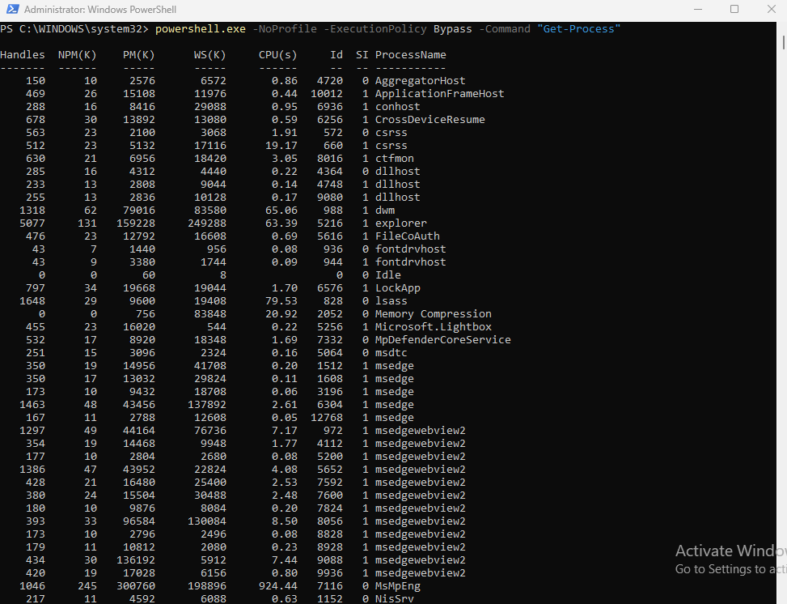
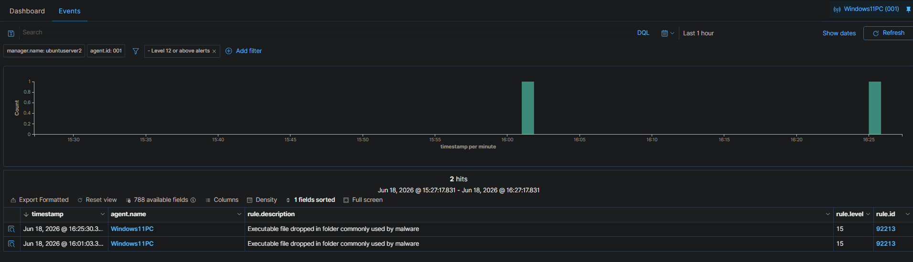
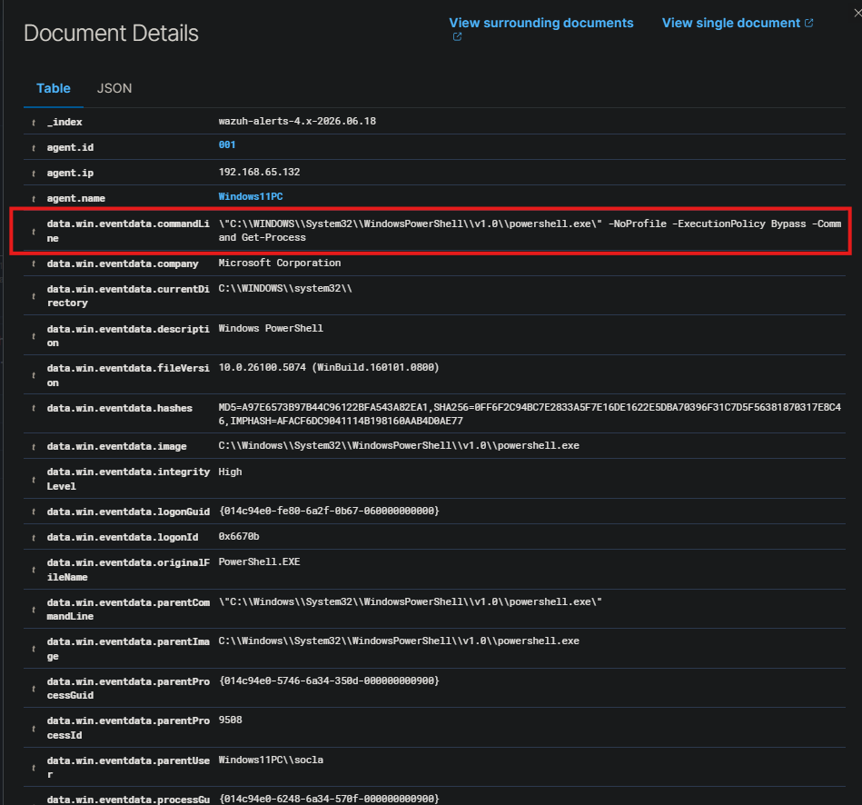
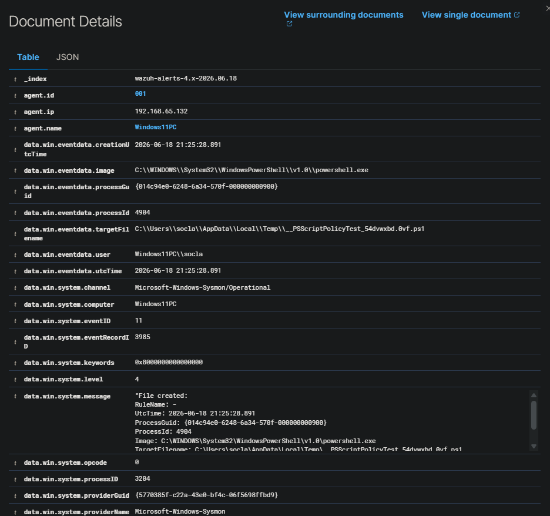

#  PowerShell Activity Monitoring

## Objective

Generate PowerShell activity on a monitored Windows 11 endpoint and verify that Wazuh can collect and display related Sysmon telemetry. This lab focuses on identifying PowerShell execution, reviewing command-line arguments, and analyzing a high-severity alert generated from PowerShell-related file activity.

## Scenario

A PowerShell command was executed on the Windows 11 endpoint using command-line options commonly reviewed during SOC investigations:

```powershell
powershell.exe -NoProfile -ExecutionPolicy Bypass -Command "Get-Process"
```

The command itself was harmless and used only to list running processes. However, the command included `-NoProfile` and `-ExecutionPolicy Bypass`, which are important flags for analysts to recognize because they may appear in suspicious PowerShell activity.

After running the command, Wazuh collected Sysmon telemetry from the Windows endpoint and generated alerts related to the PowerShell activity.

## Tools Used

| Tool          | Purpose                                                     |
| ------------- | ----------------------------------------------------------- |
| Wazuh         | SIEM/XDR platform used to review endpoint security events   |
| Wazuh Agent   | Agent installed on the Windows 11 endpoint                  |
| Windows 11 VM | Monitored endpoint                                          |
| PowerShell    | Used to generate controlled command-line activity           |
| Sysmon        | Used to provide detailed Windows process and file telemetry |

## Test Command

The following command was executed from an elevated PowerShell window:

```powershell
powershell.exe -NoProfile -ExecutionPolicy Bypass -Command "Get-Process"
```

### Command Breakdown

| Command Part              | Meaning                                                              |
| ------------------------- | -------------------------------------------------------------------- |
| `powershell.exe`          | Launches Windows PowerShell                                          |
| `-NoProfile`              | Starts PowerShell without loading the user's profile                 |
| `-ExecutionPolicy Bypass` | Bypasses the configured execution policy for that PowerShell session |
| `-Command "Get-Process"`  | Runs the `Get-Process` command to list running processes             |

## Evidence

### PowerShell Command Execution

The screenshot below shows the PowerShell command being executed on the Windows 11 endpoint. The command successfully returned a list of running processes.



---

### Wazuh High-Severity PowerShell-Related Alerts

The Wazuh Events view shows two high-severity alerts for the Windows 11 endpoint. Both alerts used rule ID `92213` with the description:

```text
Executable file dropped in folder commonly used by malware
```



---

### PowerShell Command Line Captured by Wazuh

The screenshot below shows Wazuh capturing the full PowerShell command line from Sysmon telemetry.

```powershell
"C:\WINDOWS\System32\WindowsPowerShell\v1.0\powershell.exe" -NoProfile -ExecutionPolicy Bypass -Command Get-Process
```



---

### PowerShell-Generated Temporary Script File

The expanded event details show that `powershell.exe` created a temporary `.ps1` file in the user's AppData Temp directory:

```text
C:\Users\socla\AppData\Local\Temp\__PSScriptPolicyTest_54dvwxbd.0vf.ps1
```

The event was collected from:

```text
Microsoft-Windows-Sysmon/Operational
```

and identified as Sysmon Event ID `11`, which represents file creation activity.



## Key Alert Fields

| Field            | Value                                                                     |
| ---------------- | ------------------------------------------------------------------------- |
| Agent Name       | `Windows11PC`                                                             |
| Agent IP         | `192.168.65.132`                                                          |
| Log Source       | `Microsoft-Windows-Sysmon/Operational`                                    |
| Process Image    | `C:\WINDOWS\System32\WindowsPowerShell\v1.0\powershell.exe`               |
| Command Line     | `powershell.exe -NoProfile -ExecutionPolicy Bypass -Command Get-Process`  |
| Target File      | `C:\Users\socla\AppData\Local\Temp\__PSScriptPolicyTest_54dvwxbd.0vf.ps1` |
| Sysmon Event ID  | `11`                                                                      |
| Wazuh Rule ID    | `92213`                                                                   |
| Rule Level       | `15`                                                                      |
| Rule Description | `Executable file dropped in folder commonly used by malware`              |
| MITRE ATT&CK ID  | `T1105`                                                                   |
| MITRE Tactic     | `Command and Control`                                                     |
| MITRE Technique  | `Ingress Tool Transfer`                                                   |

## Analysis

Wazuh successfully collected Sysmon telemetry from the Windows 11 endpoint and detected PowerShell-related activity. The test command launched PowerShell with `-NoProfile` and `-ExecutionPolicy Bypass`, then executed `Get-Process`.

The command was not malicious in this lab. It was intentionally executed to generate telemetry for analysis. However, the command-line options are important from a SOC perspective.

The `-NoProfile` flag can be used in legitimate automation, but it may also be used by attackers to avoid user-specific PowerShell profile settings. The `-ExecutionPolicy Bypass` flag allows the PowerShell session to bypass local execution policy restrictions for that process. This does not automatically mean the activity is malicious, but it is suspicious enough to investigate in a production environment.

Wazuh also detected that PowerShell created a temporary `.ps1` file in the user's AppData Temp directory. Temporary directories are commonly abused by malware and scripts because they are writable by normal users and often used to stage files. Wazuh generated a high-severity alert because the activity matched behavior associated with files being dropped in locations commonly used by malware.

The alert was mapped to MITRE ATT&CK technique `T1105 - Ingress Tool Transfer`. In this lab, the activity was expected and controlled, but in a real environment, this alert would require additional investigation to determine whether a script or payload was being staged or executed.
                                                                    |

## Recommended Response

If this alert occurred in a production environment, a SOC analyst should:

1. Identify the endpoint and user account involved.
2. Review the full PowerShell command line.
3. Check the parent process that launched PowerShell.
4. Determine whether the command was expected administrative activity.
5. Review the temporary `.ps1` file path and determine whether the file still exists.
6. Search for related process creation, file creation, and network connection events.
7. Escalate if the command was unauthorized, repeated, obfuscated, encoded, or associated with suspicious parent/child processes.


## Skills Demonstrated

* PowerShell activity monitoring
* Sysmon event analysis
* Wazuh event review
* Command-line argument analysis
* High-severity alert triage
* MITRE ATT&CK mapping review
* SOC-style investigation documentation

## Conclusion

This lab confirmed that Wazuh can ingest Sysmon telemetry from a Windows endpoint and detect suspicious PowerShell-related activity. Wazuh captured both the command-line execution and related file creation activity, providing useful evidence for a SOC-style investigation.
